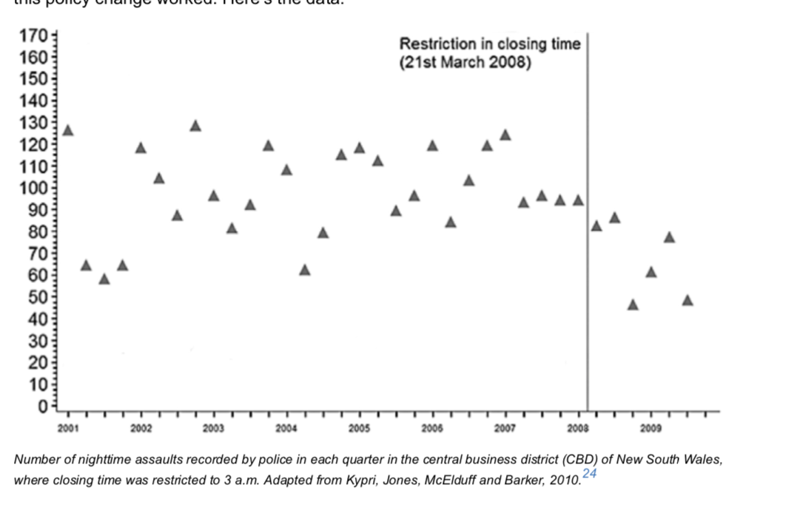
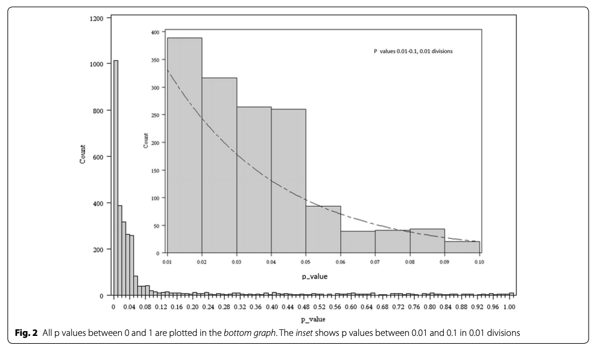

```{r setup, include=FALSE,purl=F ,echo=F, results="hide"}
library(knitr)
library(tidyverse)
knitr::opts_chunk$set(echo = TRUE, cache=T, message=F, warning=F, fig.width=4, fig.height=3, fig.align="center")
options(knitr.duplicate.label = 'allow')

```

# Terminology
1. Probability
     $$\Pr{(A)}=\frac{A}{Total} $$
2. Odds
    $$ Odds(A) = \frac{A}{Total- A} $$
    
3. Percentage chance
$$ \Pr{(A)} \times 100 $$

# Did An Earlier Closing Time Reduce Assaults

```{r closing-time, echo=F, fig.cap="Figure from course text, p. 40, 'Did the policy work'", purl=F}

```

# Did An Earlier Closing Time Reduce Assaults

There are three possible explanations for the drop in results.

1. Chance (ranom variation) 
2. Correlation 
3. Other explanations 

# Chance

How do we rule out chance?
    
1. Null hypothesis significance testing
2. dominant method of statistical inference in science
3. This is what you would see reading empirical studies in medicine, psychology, media studies, everywhere...

# Chance

How do we rule out chance?

* Read in the census data

```{r private-read-in-data, eval=T,cache=T, echo=F, purl=F}
library(haven)
census_2016<-read_sav(file="../mar_23/data/2016_individual_pumf.sav")
save(census_2016, file="../mar_23/data/census_2016.rdata")

```

```{r read-in-data, eval=F}
## This might take a few minutes!!

load(url("https://github.com/sjkiss/DMJN328/raw/master/Lecture_Notes/mar_23/data/census_2016.rdata"))

```
# Chance

How do we rule out chance?

* Select three variables, Condominium status, wages and highest degree.

```{r select-variables}
#Start with data frame and pipe
census_2016 %>% 
  #select the names of three variables and save to df
  select(CONDO, Wages, HDGREE)->df
```

# Chance

How do we rule out chance?

*Recode the HDGREE variable to be just `no degree` and `degree`

```{r recode-degree, eval=T, echo=T}
#start with df and pipe
df %>% 
  #use mutate to make a new variable degree based on the conditions in case_when()
  mutate(degree=case_when(
    #when HDGREE is less than 9, make degree no degree
    HDGREE < 9 ~ "no degree",
    #when HDGREE is between 8 and 14, makd degree degree
    HDGREE > 8 & HDGREE<14 ~ "degree",
    # all other values of HDGREE are set to missing
    TRUE ~ NA_character_
    #save
  ))->  df
  


```

# Chance

How do we rule out chance?
    * Recode the CONDO variable

```{r recode-condo}
df %>% 
  mutate(CONDO=case_when(
    CONDO ==0 ~ "no condo",
    CONDO == 1 ~ "condo",
    TRUE ~ NA_character_
  ))->df
```


# Chance
## Showing some good news...
Calculate Average Salaries by degree

```{r show-averages}
#start with data frame
df %>% 
  #groupby degree
  group_by(degree) %>% 
  #summarize average
  summarize(avg=mean(Wages, na.rm=T))

```

# Chance

Calculate average salaries by condominium status

```{r show-average-condo}
#start with data frame
df %>% 
  #Group by CONDO 
  group_by(CONDO) %>% 
  #summarize the groups by calculating the wages
  summarize(avg=mean(Wages, na.rm=T))

```
# Chance
## Sample v. Population

* Sample of the wages by degree status clearly shows a difference;
* Sample of the wages by condo status shows a difference, but the difference is smaller?
* Are the differences in the population? 
* The fundamental problem is that even large samples (e.g. with low standard errors, can always generate fluky results when there is no relationship in the population`)

# Chance
## Sample v. Population
```{r errors, echo=F, purl=F}
include_graphics("https://raw.githubusercontent.com/sjkiss/Images/master/errors_pregnant.jpg")
```

# Chance
## Null Hypothesis Significance Testing

* Dominant method of testing whether relationships in a sample should be treated as if they are in the population
* primarily meant to minimize false positives, ignores false negatives

# Chance
## Null Hypothesis Significance Testing
1. Formalize a hypothesis that these results are result of chance and a hypothesis that these are not.

| Hypothesis | Statement |
|:---------------------------:|:----------------------|
| $$ H_0 $$ |There is no relationship between level of education and wages.| 
| $$ H_1 $$  |Wages for people with degrees are higher than for people without degrees |


# Chance
## Null Hypothesis Significance Testing

2. Compare the results we get with the distribution of results we would get if $H_0$ were true.
3. If the probability of getting your data is less than some cutoff, usually 0.05, the findings are rejected.

# Chance
## Null Hypothesis Significance Testing

* Why 0.05?
     * Arbitrary
     * Under the normal distribution, only 5% of cases are above or below two standard deviations away from the mean
     * 0.01 is another common thresholds (only 1% of cases are +/- three standard deviations away from the mean)
     * Turns out, when you compare the averages of two groups, the results have a *distribution* that is very close to the normal distribution, it's called the t-distribution. 

# Chance
## Null Hypothesis Significance Testing

```{r show-density-plots, echo=F}
out<-data.frame(t=rt(5000, df=156579))
out %>% 
  ggplot(., aes(x=t))+geom_histogram(aes(y=..density..), alpha=0.2)+scale_x_continuous(breaks=seq(-3,3,1))+theme_bw()+labs(title="The t-distribution", subtitle="with samples larger than ~30, looks almost exactly\nlike the normal distribution")

```

# Chance
## Null Hypothesis Significance Testing
```{r run-t-test-degree}
t.test(Wages ~ degree, df)

```


# Chance
## Null Hypothesis Significance Testing
```{r run-t-test-condo}
t.test(Wages ~ CONDO, df)

```

# Chance
## Null Hypothesis Significance Testing
Major problems with null hypothesis significance testing

1. Results do not tell us if our finding is *true*
    * They tell is if our sample data is unlikely if we assumed the null hypothesis is true.
```{r sig1, out.width="75%", echo=F, purl=F}

include_graphics("https://raw.githubusercontent.com/sjkiss/Images/master/xkcd.png")
```

# Chance
## Null Hypothesis Significance Testing
Major problems with null hypothesis significance testing

2. Findings are accepted based on a discrete threshold, but p-values are continuous
     * what should a scientist do with a p-value of 0.06?
     * Standard procedure is that the study is published as if it were *true*
     * more nuanced response would be to appreciate that the evidence is close to conventional rules for accepting findings as true

# Chance
## Null Hypothesis Significance Testing
Major problems with null hypothesis significance testing

2. Findings are accepted based on a discrete threshold, but p-values are continuous
     * Some evidence that there is a suspiciously, abnormal number of studies published with p-values of 0.05^[Ginsel, Bastiaan, Abhinav Aggarwal, Wei Xuan, and Ian Harris. 2015. “The Distribution of Probability Values in Medical Abstracts: An Observational Study.” BMC Research Notes 8 (1): 721. https://doi.org/10.1186/s13104-015-1691-x.
]
     
```{r include-p-values-plot, fig.cap="Distribution of p-values in medical literature", echo=F, out.width="50%", out.height="50%", purl=F}

```


# Chance
## Null Hypothesis Significance Testing
Major problems with null hypothesis significance testing

3. Statistical significance is not *clinical* significance
     * a small effect can have a very small p-value
     * The wages by condominium status is a great example
     * p-value was *extremely* small, so highly statistically significant
     * but the difference in wages was pretty negligible.

# Chance
## Null Hypothesis Significance Testing
Major problems with null hypothesis significance testing

4. Ignores the prior probability of the various hypotheses
     * Case of Sally Clark ^[http://nautil.us/issue/74/networks/the-flawed-reasoning-behind-the-replication-crisis]
     * Gave birth to a baby boy, who died at 11 weeks
     * Gave birth to a nother baby boy the next year who died at 8 weeks
     * In a trial, a pediatrician calculated the odds of two babies dying consecutively of SIDS as 1 in 73 million 
     * Convicted as a double-child murderer
     
# Chance
## Null Hypothesis Significance Testing
Major problems with null hypothesis significance testing

4. Ignores the prior probability of the various hypotheses
    * Classic logic of NHST

| Hypothesis | Statement |
|:---------------------------:|:----------------------|
| $$ H_0 $$ |Sally did not kill her babies (they died of SIDS)| 
| $$ H_1 $$  |Sally did kill her babies|

# Chance
## Null Hypothesis Significance Testing
Major problems with null hypothesis significance testing

4. Ignores the prior probability of the various hypotheses
    * Classic logic of NHST
    * The probability of getting data (two babies dead) assuming the null is true, is vanishingly small. Ergo $H_0$ is not true, ergo, guilty.
    * But the probability of a mother killing her own child is *also* extremely low, let alone killing her own.
    * So if you start with the expectation that it is unlikely that a mother would kill her own child (which is true), then the probability that the null hypothesis is true starts to look a lot larger.


# Chance
## Null Hypothesis Significance Testing
Major problems with null hypothesis significance testing

4. Nobody likes a story with nothing to tell
     * Null findings are not published
     * Phenomenon is known as publication bias (or file drawer effect)^[https://blogs.scientificamerican.com/observations/were-incentivizing-bad-science/]

# Chance
## Null Hypothesis Significance Testing
Major problems with null hypothesis significance testing

4. Nobody likes a story with nothing to tell
```{r sig2, echo=F, purl=F}
include_graphics("https://raw.githubusercontent.com/sjkiss/Images/master/xkcd_significance.png")
```

# Chance
## Null Hypothesis Significance Testing
Major problems with null hypothesis significance testing

4. Nobody likes a story with nothing to tell
    * Loop back to the importance of prior probabilities
    * If you know that scientists tend to only publish positive findings, how should you interpret a very small p-value? 
    * We should treat it skeptically because the likelihood is at least somewhat high that it is a false positive, even though the small p-value is supposed to minimize the chances of that.
